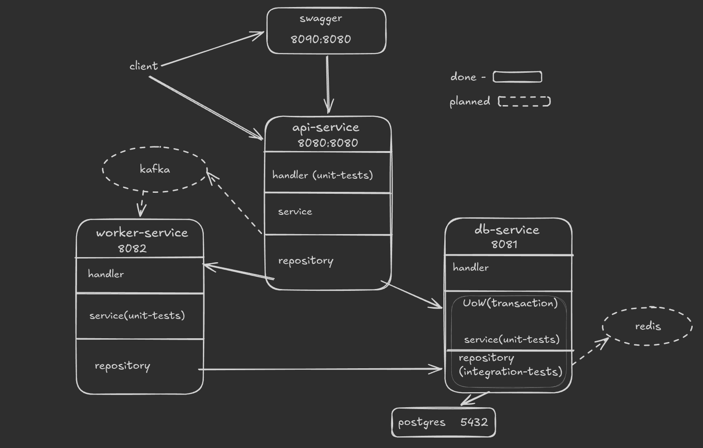

# Alchemical Laboratory
## a potion-brewing system 

## Architecture



## Tech Stack
- Go 1.25.7
- PostgreSQL 17
- Docker / docker-compose
- sqlx, testcontainers-go, testify, mockery

## How to run
```
make init
make up
```
## swagger location 

[local](http://localhost:8090/)


## API Endpoints
POST /ingredients
GET  /ingredients
PATCH  /ingredients/{id}
POST /recipes
GET  /recipes
POST /brew
GET  /brew/status

## Testing
make test           # run all tests
make test-cover     # run with coverage report

## Roadmap
- [x] Monolith — single service, single database
- [x] Divide into microservices (api / db / worker)
- [x] Unit and integration tests
- [x] Docker containerization + graceful shutdown
- [x] Swagger documentation
- [ ] HTTP → gRPC between services
- [ ] Redis caching for recipes
- [ ] Kafka for async worker jobs